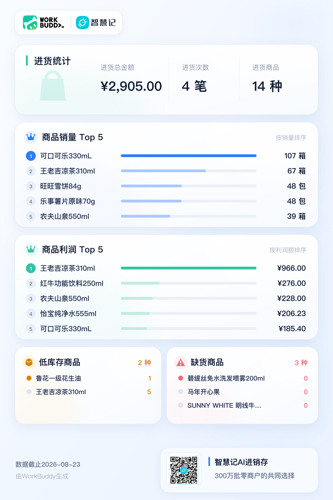

# 智慧记图报

基于智慧记AI进销存数据，生成适合手机查看的经营日历和经营月报。

## 支持能力

- 经营日历：按日展示指定月份的经营数据。
- 经营月报：展示经营概览、商品与库存、收款与客户。

## 使用方式

连接智慧记后，可以直接说：

- “给我发下这个月的收款日历”
- “看看这个月整体经营情况”
- “上个月生意怎么样？”

## 效果预览

以下图片使用模拟数据。

<table>
  <tr>
    <td align="center"><strong>经营日历</strong></td>
    <td align="center"><strong>经营月报 · 经营概览</strong></td>
  </tr>
  <tr>
    <td width="50%"></td>
    <td width="50%"></td>
  </tr>
  <tr>
    <td align="center"><strong>经营月报 · 商品与库存</strong></td>
    <td align="center"><strong>经营月报 · 收款与客户</strong></td>
  </tr>
  <tr>
    <td width="50%"></td>
    <td width="50%"></td>
  </tr>
</table>

## 发布说明

仓库版保留 README、效果图、开发说明和 WorkBuddy 插件元数据。SkillHub 版只保留产品入口、平台示例语和运行所需文件，不带 README 与展示图。

两个发布版共用 `skills/business-posters/` 中的同一套运行代码。正式交付由发布脚本同时生成两个 ZIP，并校验版本号、代码哈希、公开文案和旧功能残留。
